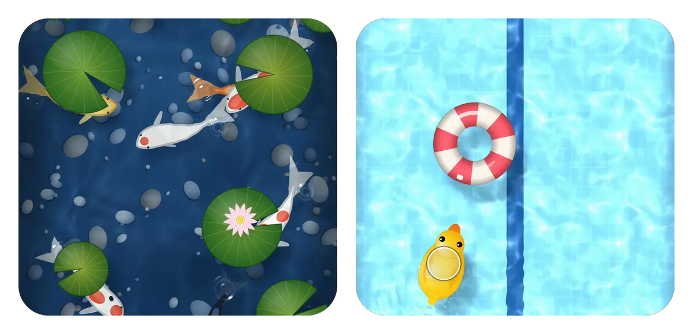
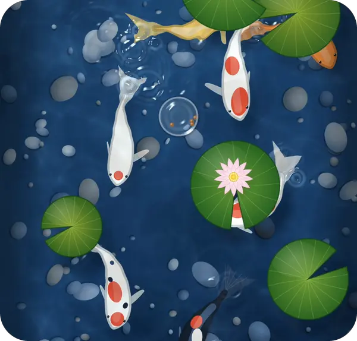
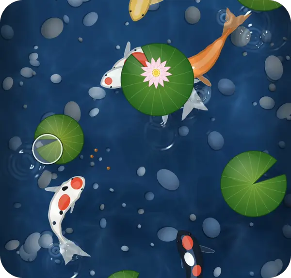
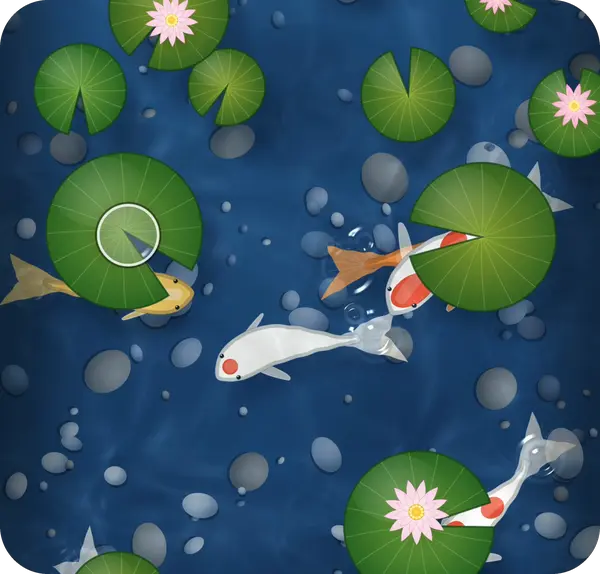
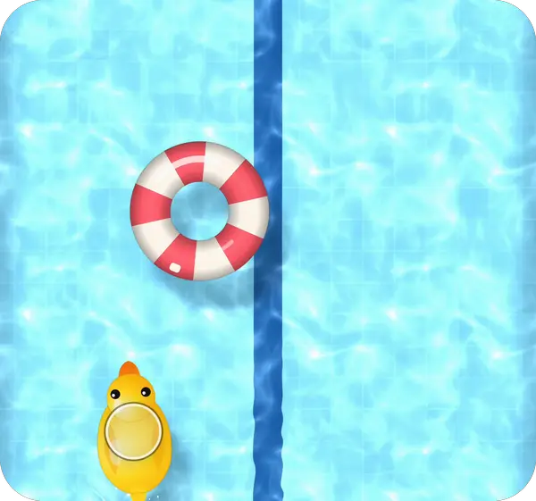
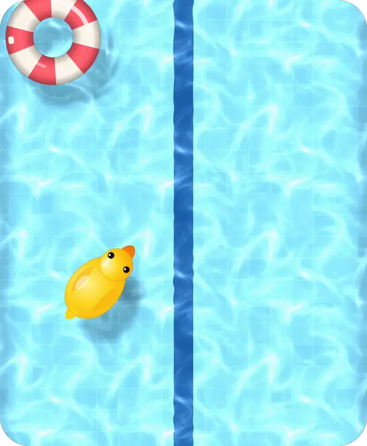

<p align="center">
  
</p>

<h1 align="center">KoiPond</h1>

<p align="center">
  A living koi pond for SwiftUI.<br />
  Koi glide over any view, lily pads drift on top, and the water ripples and refracts all of it.
</p>

<p align="center">
  
  
  
  
  
</p>

---

```swift
MyView().koiPond()
```

That is the whole integration. Your view becomes the bottom of a pond. Seven koi glide over it, lily pads drift on the surface, and a Metal shader ripples and refracts all of it, answering every fish that swims by. Tap the water and food scatters, and the koi race for it. Drag through it and they dart away. Switch to the pool and the koi drain out as a rubber duck and a striped float drop in, ready to grab and fling.

**[Download the demo video (MP4)](assets/demo.mp4)**

## Installation

In Xcode: **File > Add Package Dependencies** and paste

```
https://github.com/haplollc/KoiPond
```

Or in `Package.swift`:

```swift
dependencies: [
    .package(url: "https://github.com/haplollc/KoiPond", from: "1.0.0")
]
```

Then add `KoiPond` to your target's dependencies.

## Quick start

The ready-made pond has a bed of pebbles under the koi and a tiled floor under the pool:

```swift
import SwiftUI
import KoiPond

struct PondScreen: View {
    @State private var mode = KoiPondMode.pond

    var body: some View {
        KoiPond(mode: mode) { pond in
            Button(pond.poolMix < 0.5 ? "Drain it" : "Fill it") {
                mode = mode == .pond ? .pool : .pond
            }
            .buttonStyle(.borderedProminent)
            .frame(maxHeight: .infinity, alignment: .bottom)
            .padding(.bottom, 40)
        }
        .ignoresSafeArea()
    }
}
```

## Things to do in it

| Tap to feed | Drag to stir | Push a lily pad |
|:---:|:---:|:---:|
|  |  |  |

- **Tap to feed.** Pellets land where you tap, and the koi come for them, slowing to turn onto one beside them rather than circling it. Each gulp rings the surface.
- **Drag to stir.** Rings spread from your finger as it moves. The koi bolt away from it, then drift apart and settle.
- **Push a lily pad.** Drag one across the pond. It shoulders the others out of its way, and drifts on at the speed you let go.

| Grab and fling | Pond ⇄ pool |
|:---:|:---:|
|  |  |

- **Grab and fling.** In the pool, carry the rubber duck anywhere, or throw the float off the far wall. Both bob on every ring that reaches them.
- **Pond ⇄ pool.** Change `mode` and the water eases across in about a second: the koi and lily pads fade as the tiles come up and the duck and float drop in with a splash. Change it back and the pond returns.

## Your own floor

Any view can be the bottom of the pond:

```swift
Image("garden")
    .resizable()
    .scaledToFill()
    .koiPond()
```

The floor is flattened into one layer for the water to bend, so it has to be something SwiftUI draws itself: shapes, gradients, images, text, a `Canvas`. Views backed by UIKit (maps, text fields, video, web views) don't render inside it.

```swift
LinearGradient(colors: [.teal, .indigo], startPoint: .top, endPoint: .bottom)
    .koiPond(.pond, koi: 12)                 // any number from 0 to 40
```

## Drawing over the water

The pond takes the touches in its frame, to feed, stir, drag and fling. Put your controls over the water in the overlay instead of in the floor. The overlay is rebuilt on every frame of the pond with a `KoiPondFrame`, so anything you draw from it moves on the pond's own clock:

```swift
MyFloor()
    .koiPond(mode, keepClear: EdgeInsets(top: 0, leading: 0, bottom: 90, trailing: 0)) { pond in
        ModePicker(selection: $mode, progress: pond.poolMix)   // slides as the water changes
            .frame(maxHeight: .infinity, alignment: .bottom)
            .padding(.bottom, 32)
    }
```

| `KoiPondFrame` | |
|---|---|
| `poolMix` | 0 is all pond, 1 all pool. When `mode` changes it eases across in about a second. |
| `time` | Seconds on the pond's clock since it first appeared. |
| `size` | The pond's size in points. |

`keepClear` marks bands along the edges that the duck and the float stay out of, such as under your controls. One flung in is eased back out.

## How it works

- **The water** is a `layerEffect` Metal shader over the floor and the koi, flattened into one layer. Rings spread from every tap, splash and gulp. Each koi lifts a soft swell, and its tail sheds small swirls on alternate sides, so a wake trails it the way a real one does. The floor is seen through the surface's slope, sunlight focused by the ripples dances on it (dappled in the pond, a bright net in the pool), the water tints with depth, and the sun glints off the crests. The bend is softly capped, so a fish under a strong ring wobbles but never tears.
- **The koi** are drawn, not sprites: each has a body that follows its head, with every joint limited in how far it bends, so a hard turn swings the whole fish round instead of curling it into a C. They wander in long arcs, give each other room, hurry to food, and bolt from a finger.
- **The pool** floats the duck and the float on the same rings. They carry with your finger, leave with its speed, bounce off the walls, and bob as the water moves.
- **One clock.** Everything is a function of one deterministic clock, so a take can be slowed down for recording and come out frame-exact. The demo video was made that way.
- **Haptics.** A light tap when you touch the water, a soft one when you pick something up, and a firmer one as the pool's floaters land.

## Accessibility

The lily pads, the duck and the float are accessibility elements wherever they are on the water, labelled "Lily pad", "Rubber duck" and "Pool float". The floor's decoration is hidden from VoiceOver. The pond itself is play, so label the screen it's on for what it is.

## Requirements

- iOS 17+.
- Swift 6, Xcode 26+.

## Development

```bash
xcodebuild test -scheme KoiPond -destination "platform=iOS Simulator,name=iPhone 17 Pro"
open Demo/KoiPondDemo.xcodeproj    # the pond, full screen, with Pond | Pool
xcodebuild test -project Demo/KoiPondDemo.xcodeproj -scheme KoiPondDemo \
    -destination "platform=iOS Simulator,name=iPhone 17 Pro" -parallel-testing-enabled NO
```

The unit tests cover the seeded randomness, the scripted finger's paths, the take clock and the public API, and compile every snippet in this README against the package. The demo app's UI tests play with the pond on an iPhone simulator the way a person would, with nothing stubbed. They tap the water and check the koi eat the food, drag through it and check it ripples where the finger went and not elsewhere, switch to the pool and drag the duck across, and push a lily pad aside.

The media in this README are recorded from the demo with the scripts in `Scripts/`:
- `record.sh` plays a scripted take slowed down on a simulator.
- `sync.py` and `retime.py` rebuild it at an exact 60 fps from the clock stamped in its corner.
- `media.py` cuts the animations, as WebP: a GIF of moving water is ten times the size.

## License

KoiPond is available under the [MIT license](LICENSE).

Made by [Haplo LLC](https://haploapp.com).
